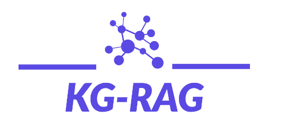
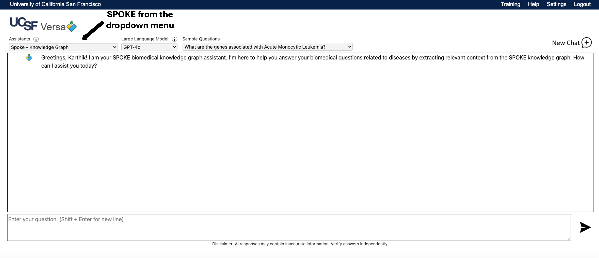
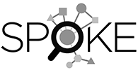
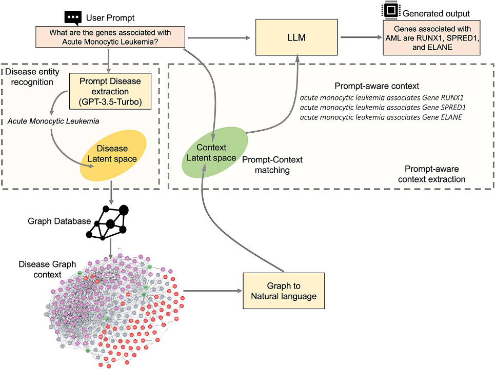
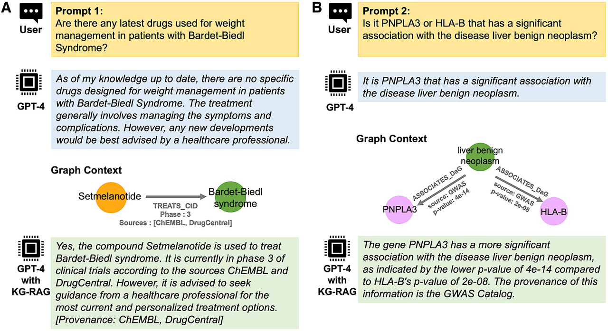

<div align="center">
  

  # KG-RAG: Knowledge Graph-Enhanced Biomedical Assistant

  A specialized assistant in Versa that enhances Large Language Models with SPOKE biomedical knowledge
  
  [Quick Start](#quick-start) • [KG-RAG](#what-is-kg-rag) • [Examples](#example-queries) • [API Documentation](docs/API.md)
</div>

## Table of Contents
- [Quick Start](#quick-start)
- [What is SPOKE?](#what-is-spoke)
- [What is KG-RAG?](#what-is-kg-rag)
- [Using KG-RAG in Versa](#using-kg-rag-in-versa)
- [KG-RAG API Access](#kg-rag-api-access)
- [Additional Resources](#additional-resources)

## Quick Start

1. Access Versa (requires UCSF authentication)
2. Select "SPOKE - Knowledge Graph" from Assistants dropdown
3. Choose your preferred language model (e.g., GPT-4o)
4. Ask your disease-related biomedical question
5. Review the evidence-based response with sources

<div align="center">
  
  <p><i>Versa interface showing SPOKE Knowledge Graph selection (which uses KG-RAG in the backend)</i></p>
</div>


## What is SPOKE?

<div align="center">
  
  <p><i>SPOKE: Scalable Precision Medicine Open Knowledge Engine</i></p>
</div>

SPOKE (Scalable Precision Medicine Open Knowledge Engine) is UCSF's comprehensive biomedical knowledge graph that integrates and connects information from over 40 specialized databases. It serves as a unified platform for biomedical knowledge, making complex relationships between different biological entities discoverable and accessible.

### Key Statistics
- **Nodes**: 27+ million nodes of 21 different types
- **Edges**: 53+ million edges of 55 different types
- **Sources**: Integrates 41+ specialized biomedical databases
- **Updates**: Refreshed weekly to ensure current information

### Data Quality
- Prioritizes experimentally validated information
- Maintains clear provenance for all relationships
- Provides statistical evidence when available (p-values, z-score, confidence scores)
- Focuses on curated databases rather than text mining

### Example SPOKE Relationships
- Disease-Disease Ontology associations
- Disease-Gene associations
- Disease-Symptom relationships
- Disease-Compound associations
- Compound-Protein interactions
- Protein-Protein interactions
- Anatomical hierarchies
and many more

> 📚 For more detailed information about SPOKE, visit the [SPOKE Explorer](https://spoke.rbvi.ucsf.edu) or read the [SPOKE Paper](https://academic.oup.com/bioinformatics/article/39/2/btad080/7033465).


## What is KG-RAG?

KG-RAG (Knowledge Graph Retrieval Augmented Generation) is a specialized framework that enhances Large Language Models (LLMs) with SPOKE's biomedical knowledge. By combining the reasoning capabilities of LLMs with verified biomedical information from SPOKE, KG-RAG provides reliable, evidence-based responses to biomedical questions.

### Core Components

1. **Large Language Models (LLMs)**
   - Advanced AI models like GPT-4
   - Natural language understanding and generation
   - Reasoning capabilities

2. **SPOKE Knowledge Graph**
   - Verified biomedical knowledge
   - Structured relationships
   - Statistical evidence and provenance

3. **Sentence Transformers**
   - Creates embeddings of biomedical context from SPOKE
   - Creates embeddings of user queries
   - Enables context pruning through semantic similarity, thereby optimizes the knowledge retrieval

### How It Works

<div align="center">
  
  <p><i>KG-RAG's workflow for processing biomedical queries</i></p>
</div>

1. **Disease Recognition**
   - Uses sentence transformers to embed user questions
   - Matches with disease entities in SPOKE
   - Ensures accurate disease identification

2. **Context Retrieval & Pruning**
   - Extracts relevant context from SPOKE
   - Uses sentence transformers to embed biomedical context
   - Prunes context based on semantic similarity to query

3. **Context Enhancement**
   - Combines pruned knowledge with LLM capabilities
   - Pruning optimizes the token utilization for the LLM
   - Preserves evidence and provenance information

4. **Response Generation**
   - Generates comprehensive answers grounded on factual biomedical knowledge from SPOKE
   - Includes evidence-based support
   - Maintains scientific accuracy
   - Provided provenance in the generated text 

### Core Features & Benefits

#### 🎯 Knowledge-Grounded Responses
- **Verified Information**
  - Responses backed by SPOKE's curated biomedical knowledge
  - Clear provenance for all information

- **Scientific Accuracy**
  - Statistical evidence when available (Note: Versa maynot support this, but KG-RAG API does)
  - Multiple source validation

#### 🔍 Advanced Query Processing
- **Intelligent Disease Recognition**
  - Robust entity recognition using embeddings
  - Handles variations in disease names
  - Maps to standardized disease concepts

- **Smart Context Retrieval**
  - Semantic matching for relevant information
  - Efficient pruning of knowledge graph data
  - Optimal context selection

#### ⚡ Enhanced Performance
- **Token Efficiency**
  - Optimized context selection
  - Reduced token usage compared to traditional RAG
  - Cost-effective implementation

- **Consistent Results**
  - Stable responses across LLM updates
  - Evidence-based conclusions

### Example KG-RAG Capabilities

<div align="center">
  
  <p><i>Examples of KG-RAG's comprehensive responses with statistical evidence. Note that these queries were run in March 2024 using GPT-4. When running the same queries today, GPT-4-only responses (blue box) may differ from those shown in the figure due to the possible model updates from OpenAI.</i></p>
</div>

#### Example 1: Drug-Disease Relationships
**Query**: "Are there any latest drugs used for weight management in patients with Bardet-Biedl Syndrome?"

KG-RAG provides:
- Retrieves drug treatment information from SPOKE
- Shows clinical trial phase (Phase 3)
- Includes multiple source databases (ChEMBL, DrugCentral)
- Provides clear provenance for information

#### Example 2: Gene-Disease Associations
**Query**: "Is it PNPLA3 or HLA-B that has a significant association with the disease liver benign neoplasm?"

KG-RAG provides:
- Comparative statistical analysis
- Precise p-values (PNPLA3: 4e-14, HLA-B: 2e-08)
- Source attribution (GWAS Catalog)
- Evidence-based conclusion

> 💡 Note: These examples demonstrate KG-RAG's full capabilities with statistical evidence. The current Versa implementation may have different features, which we'll discuss in the [Using KG-RAG in Versa](#using-kg-rag-in-versa) section.


> 📚 For more technical details about KG-RAG's architecture and performance, read our [research paper](https://academic.oup.com/bioinformatics/article/40/9/btae560/7759620) published in Bioinformatics.


## Using KG-RAG in UCSF Versa

KG-RAG is available in UCSF Versa as a specialized assistant that enables biomedical question-answering using SPOKE knowledge. Here's how to effectively use KG-RAG in Versa:


### Getting Started

1. **Connect to UCSF VPN**
To access the Versa application, users must first connect to the UCSF VPN.

2. **Select the Assistant**
   - Choose "SPOKE - Knowledge Graph" from the Assistants dropdown menu of Versa
   - Select your preferred language model (e.g., GPT-4o)

<div align="center">
  
  <p><i>Versa interface showing SPOKE Knowledge Graph selection (which uses KG-RAG in the backend)</i></p>
</div>

3. **Frame Your Question**
   - Currently, Versa accepts only disease-related queries (i.e. queries that have disease names mentioned in it. e.g. <i>what are the genes associated with multiple sclerosis?</i>)
   - Be specific and clear in your questions

> 💡 **Disease Coverage**: SPOKE contains 11,697 disease concepts, providing comprehensive coverage across various medical domains. This means users can inquire about a wide spectrum of diseases, from common conditions to rare disorders, all backed by verified biomedical knowledge.


### Current Implementation Notes
- For now, Versa's KG-RAG implementation focuses on disease-centric questions
- Responses will include information sourced from SPOKE
- While statistical evidence is available in SPOKE, the current Versa implementation doesn't use that (you can get that information using [KG-RAG API](#api-access))

### Response Structure in Versa
KG-RAG in Versa provides structured responses in three sections:

1. **SPOKE-Prioritized Response**
   - Presents findings directly from SPOKE knowledge base
   - Lists entities with their relationships
   - Includes provenance information (data sources)
   - Complemented with relevant LLM knowledge

2. **Analysis Without SPOKE**
   - Provides context from LLM's training
   - Offers additional insights
   - Helps validate and complement SPOKE information

3. **Summary**
   - Combines insights from both sources
   - Highlights key findings from SPOKE
   - Includes additional context from LLM
   - Provides comprehensive conclusions

> 💡 **Example Response Format:**
```text
SECTION 1 - SPOKE-PRIORITIZED RESPONSE:
Based on SPOKE knowledge base:
* Information directly from SPOKE with provenance
* Additional context from LLM

SECTION 2 - ANALYSIS WITHOUT SPOKE:
Based on trained biomedical knowledge:
* LLM's knowledge about the topic without using SPOKE

SECTION 3 - SUMMARY:
From Section 1 (with SPOKE):
* Key findings from SPOKE

From Section 2 (without SPOKE):
* Key findings from LLM

Final comprehensive conclusion combining insights from Section 1 and Section 2.
```

### Best Practices - Recommended Query Types

#### ✅ Direct Queries
Based on SPOKE's knowledge graph structure, you can ask questions about:

🔎 **Gene-Disease Associations**
*Example: "What genes are associated with Acute Monocytic Leukemia?"*

🔎 **Disease-Disease Similarity**
*Example: "Which diseases are similar to Parkinson's disease?"*

🔎 **Disease-Disease Ontology**
*Example: "What is the disease ontology of Alzheimer's disease?"*

🔎 **Disease-Drug Treatments**
*Example: "What drugs are used to treat multiple sclerosis?"*

🔎 **Disease-Symptom Relationships**
*Example: "What are the symptoms of Bardet-Biedl Syndrome?"*

🔎 **Disease-Organism Associations**
*Example: "Which organisms can cause pneumonia?"*

🔎 **Disease-Anatomy Localization**
*Example: "Which anatomical structures are affected by diabetes?"*

#### ✅ Intersection Queries
KG-RAG also supports queries that combine multiple relationship types or explore intersections between two or more diseases. Here are some examples:

🔎 **Disease-Gene-Disease Connections**
*Example: "What genes are common between Parkinson's disease and Alzheimer's disease?"*

🔎 **Disease-Symptom-Disease Patterns**
*Example: "What symptoms are shared between multiple sclerosis and lupus?"*

🔎 **Disease-Drug-Disease Relationships**
*Example: "What drugs are used to treat both rheumatoid arthritis and psoriatic arthritis?"*

🔎 **Disease-Anatomy-Disease Associations**
*Example: "Which anatomical structures are affected by both diabetes and hypertension?"*

> 💡 **Tip**: When forming intersection queries, clearly specify both diseases and the relationship type you're interested in exploring between them.

### Limitations

#### 🕒 Response Time
Current average response time:
 - GPT-4o: 24.5 ± 17.7 seconds
 - GPT-4: 30.3 ± 9.6 seconds

These latencies are due to multiple API calls in the backend pipeline:
1. User query → GPT API (disease entity extraction)
2. Azure API (semantic search)
3. KG-RAG API (context extraction from SPOKE)
4. GPT API (response generation and summarization)

#### 🎯 Query Scope
- Currently limited to disease-centric questions
- Queries must explicitly mention disease names
- Other biomedical queries (e.g., drug-protein interactions without disease context) are not supported in the current Versa implementation
- For broader biomedical queries, consider using the [KG-RAG API](#api-access)

#### 🔍 Graph Search Depth
- Versa's implementation uses single-hop graph search for optimal performance
- While deeper graph searches are possible through the KG-RAG API, they result in:
 - Exponential increase in response time
 - Larger context volume
 - Higher API costs

### Want to See More?
For a comprehensive collection of example queries and their responses, visit our [Examples Guide](docs/EXAMPLES.md).

## KG-RAG API Access

While KG-RAG is integrated into Versa for disease-centric queries, you can also access it directly through our REST APIs for broader biomedical questions. We provide two specialized endpoints:

### Available Endpoints

1. **Disease-Centric Endpoint** (`v1/kg_rag_context`)
   - Optimized for disease-related queries
   - Used by Versa integration
   - Requires specific disease nodes

2. **Extended Endpoint** (`v1/kg_rag_context_extended`)
   - Supports broader biomedical queries
   - No disease node requirement
   - More flexible querying capabilities

### Key Features
- Access to complete SPOKE knowledge
- Statistical evidence inclusion option
- Configurable search depth
- Detailed provenance information

For detailed documentation, including:
- Complete API reference
- Code examples
- Response formats
- Implementation guidelines

📚 Please refer to our [API Documentation](docs/API.md)


## Additional Resources

### 📚 Publications
- [KG-RAG Paper](https://academic.oup.com/bioinformatics/article/40/9/btae560/7759620) - Technical details about KG-RAG framework and its performance
- [SPOKE Paper](https://academic.oup.com/bioinformatics/article/39/2/btad080/7033465) - Comprehensive overview of SPOKE knowledge graph

### 🛠️ Development Resources
- [KG-RAG GitHub Repository](https://github.com/BaranziniLab/KG_RAG) - Open-source code and setup instructions
- [SPOKE API Documentation](https://spoke.rbvi.ucsf.edu/swagger/) - Complete SPOKE API reference

### 🔍 Tools
- [SPOKE Explorer](https://spoke.rbvi.ucsf.edu/) - Interactive interface to explore SPOKE knowledge graph

> 💡 **Want to run KG-RAG on your machine?** Follow the instructions in the [KG-RAG GitHub repository](https://github.com/BaranziniLab/KG_RAG) to set up and run KG-RAG locally.